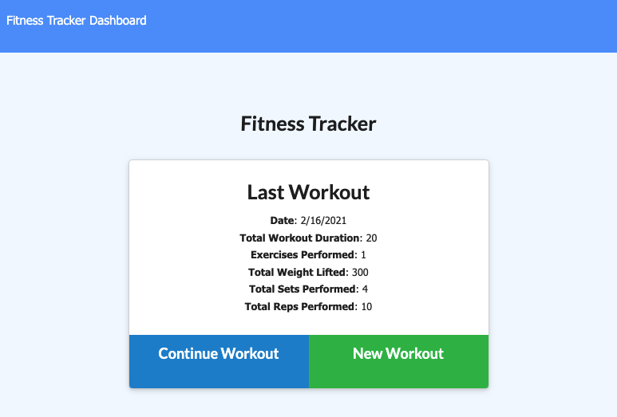

# Get Fit

## Table of Contents
* [Project Summary](#project-summary)
* [How to Access](#how-to-access)
* [Technologies Used](#technologies-used)
* [About Me](#about-me)
* [Screenshots](#screenshots)
* [Code Snippets](#code-snippets)

## Project Summary
This is a fitness and workout tracker that utilizes MongoDB and Mongoose.js to create a database of your workouts.

## How to Access
* [Fitness Tracker](https://enigmatic-forest-51441.herokuapp.com)

## Technologies Used
* [JavaScript](https://developer.mozilla.org/en-US/docs/Web/JavaScript)
* [Node](https://nodejs.org/en/)
* [Express](https://expressjs.com/)
* [MongoDB](https://www.mongodb.com/)
* [Mongoose](https://mongoosejs.com/)

## About Me
* [LinkedIn](https://www.linkedin.com/in/the-real-jordan-kelly/)
* [GitHub](https://github.com/profjjk)

## Screenshots



## Code Snippets
This code retrieves the last seven workouts from the database and sends them along to the front end.
```javascript
  app.get('/api/workouts/range', (req, res) => {
    db.Workout.find({}).sort({ day: -1 }).limit(7)
      .then(weekWorkouts => {
        console.log("--- Last 7 Workouts ---");
        console.log(weekWorkouts);
        res.json(weekWorkouts.reverse());
      })
      .catch(err => {
        console.log(err);
        res.json(err);
      });
  })
```
This code adds a new exercise to the most recent workout.
```javascript
  app.put('/api/workouts/:id', (req, res) => {
    console.log('--- Add Exercise ---')
    console.log(req.body);
    db.Workout.findOneAndUpdate({ _id: req.params.id },
      { $push: { exercises: req.body }}, { new: true })
      .then(updWorkout => {
        console.log('--- Updated Workout ---');
        console.log(updWorkout);
        res.json(updWorkout);
      })
      .catch(err => {
        console.log(err);
        res.json(err);
      });
  });
```
This code creates a Mongoose virtual schema to add up the total duration of all exercises.
```javascript
WorkoutSchema.virtual('totalDuration').get(function() {
  let totalDuration = 0;
  for (let i = 0; i < this.exercises.length; i++) {
    totalDuration += this.exercises[i].duration
  }
  return totalDuration;
});
```

[](https://opensource.org/licenses/MIT)